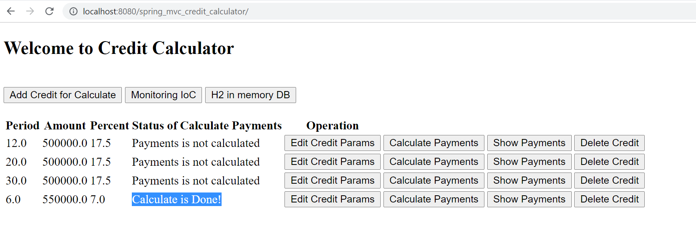
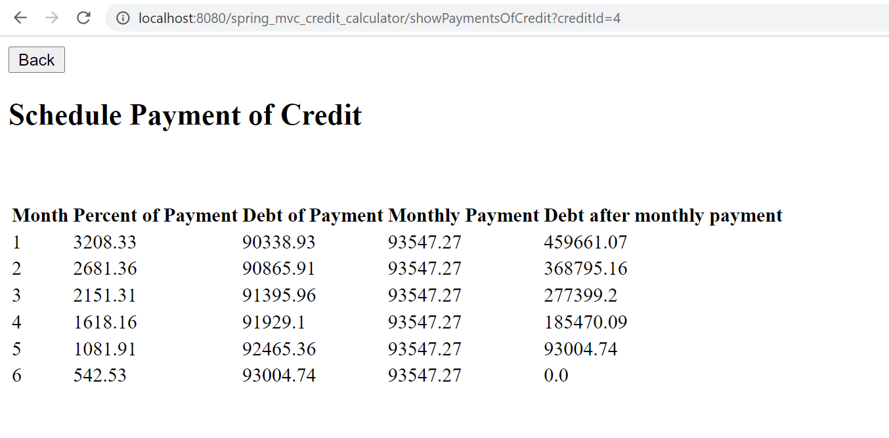
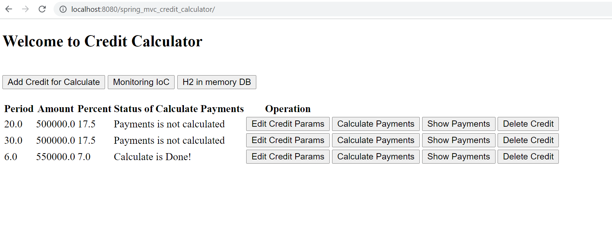

# Annuity Credit Calculator
Technologies:
- Spring MVC
- UI - JSP + JSTL
- DB - H2 in memory and Hibernate
- Connection pool / Transaction control with c3p0
- Validation params with Hibernate-validator and custom annotation
- Locale server - Apache Tomcat

This application demonstrates a CRUD operations with Credit in DataBase with Hibernate and Calculation of the loan schedule

Interface in my Application 

- Main Page 

- Add and Edit page with validation

- After add/edit Credit your need press on button "Calculate Payments" and status is change

- If you want to see Schedule of Payments your Credit -> press button "Show Payments"

- Delete Credit with schedule Payments (Hibernate-CascadeAll and Bi-directional). Delete Credit with id=1

- Also added to this project Monitoring Beans in IoC and ling for DB in memory

